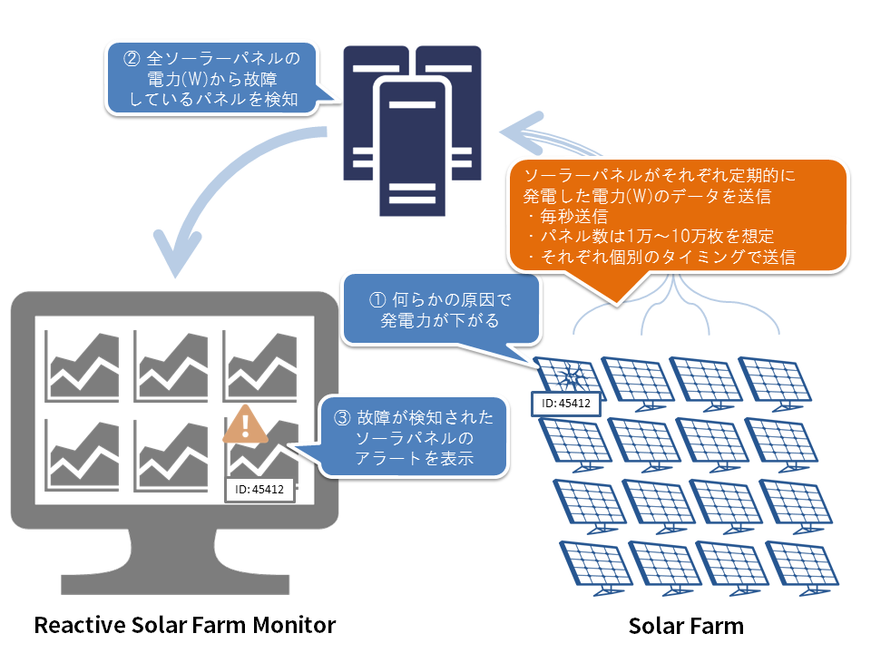

Reactive Solar Farm Monitor
===========================

([English](README.md)/日本語)

Reactive Solar Farm Monitor は [Typesafe Reactive Platform](http://www.typesafe.com/products/typesafe-reactive-platform) を利用したリアクティブシステムの具体例を示すため作成されたサンプル実装です。

リアクティブシステムとは？
--------------------------
下記の要件を満たすシステムがリアクティブシステムです。
* すばやい応答時間を保ち高いユーザービリティを実現
* 限りなく100%に近い稼働率を達成
* ワークロードが変動してもスケールアウト/スケールインが容易

詳細は[リアクティブ宣言](http://www.reactivemanifesto.org/ja)を参照してください。

Typesafe Reactive Platform とは？
---------------------------------
[Play Framework](https://playframework.com/)、[Akka](http://akka.io/)、[Scala](http://www.scala-lang.org/)、[Java](https://www.java.com/) を組み合わせることでリアクティブシステムを実現することができる開発基盤です。

詳細は [Typesafe Reactive Platform](http://www.typesafe.com/products/typesafe-reactive-platform) を参照してください。

概要
----
本サンプルシステムはソーラーファーム(大規模な太陽光発電所)に設置されたソーラーパネルの故障を検知するシステムを想定しています。

ソーラーファームには数万枚のソーラーパネルが設置されており、各ソーラーパネルにはそのパネルの発電量を逐次測定するデバイスが取り付けられています。
このデバイスが測定した発電量をもとにソーラーパネルの故障を検知できないでしょうか。
単にソーラーパネルの発電量が低下(ある閾値を下回る)したことを故障としてしまうと、悪天候でたまたま発電量が少なくなってしまった場合もソーラーパネルが故障したとみなされてしまいます。
そこで、このシステムではある瞬間における全ソーラーパネルの平均発電量と各ソーラーパネルの発電量を比較し、発電量が著しく平均を下回っているソーラーパネルを故障したとみなしています。

また、このシステムには達成しなければならない下記のような要件があります。

* ソーラーファームの発電効率を高めるため、ソーラーパネルの故障は1秒以内に検知できる
* 故障検知までのタイムラグが生じないように、稼働率は100%を達成する
* ソーラーファームの規模が拡大しソーラーパネルが増えた場合にスケールアウトできる

アーキテクチャ
--------------
本サンプルシステムは [Typesafe Reactive Platform](http://www.typesafe.com/products/typesafe-reactive-platform) を利用し、メッセージ駆動のアーキテクチャを採用しています。

スクリーンショット
------------------

起動方法
---------

### Docker を利用した起動

[Docker](https://www.docker.com/) がインストールされたPCで下記のコマンドを実行してください。

~~~
docker run -d --name=broker                                    crowbary/apache-apollo
docker run -d --name=solar_farm_simulator --link=broker:broker crowbary/reactive-solar-farm-monitor-solar-farm-simulator
docker run -d --name=monitor -p 9000:9000                      crowbary/reactive-solar-farm-monitor
docker run -d --name=analyzer_seed  --link=broker:broker --link=monitor:primary_seed                                      crowbary/reactive-solar-farm-monitor-analyzer
docker run -d --name=analyzer_node1 --link=broker:broker --link=monitor:primary_seed --link=analyzer_seed:secondary_seed  crowbary/reactive-solar-farm-monitor-analyzer
docker run -d --name=analyzer_node2 --link=broker:broker --link=monitor:primary_seed --link=analyzer_seed:secondary_seed  crowbary/reactive-solar-farm-monitor-analyzer
~~~

ブラウザで http://[DOCKER_HOST]:9000/ へアクセスしてください。
* DOCKER_HOST: 上記の docker run コマンドを実行したホストのIPアドレスまたはホスト名

Analyzer のノードはいくつでも追加することができ、下記のコマンドを実行することで Analyzer のノードが新たに一つ立ち上がります。
~~~
docker run -d --link=broker:broker --link=monitor:primary_seed --link=analyzer_seed:secondary_seed  crowbary/reactive-solar-farm-monitor-analyzer
~~~

### sbtを利用した起動

#### 1. 実行前の環境構築

##### (1) sbtのインストール

[Mac](http://www.scala-sbt.org/0.13/docs/ja/Installing-sbt-on-Mac.html)、[Windows](http://www.scala-sbt.org/0.13/docs/ja/Installing-sbt-on-Windows.html)、もしくは [Linux](http://www.scala-sbt.org/0.13/docs/ja/Installing-sbt-on-Linux.html) の手順に従ってインストールしてください

##### (2) Apache Apolloのインストール

* [Apache Apolloのサイト](https://activemq.apache.org/apollo/download.html) よりインストーラをダウンロード
* 任意ディレクトリ（${APOLLO_HOME}）に解凍
* 任意ディレクトリ（${APOLLO_EXEC}）でBroker Instanceの作成
~~~
cd ${APOLLO_EXEC}
${APOLLO_HOME}\bin\apollo create mybroker
~~~
* ※ [参考サイト](http://activemq.apache.org/apollo/versions/1.7.1/website/documentation/getting-started.html)

##### (3) Bowerのインストール

* [Node.js](https://nodejs.org/)のインストール
* [Git](http://git-scm.com/downloads)のインストール
    * Windowsの場合、「Adjusting your PATH environment」で「Use Git from the Windows Command Prompt」をチェックしGitコマンドを有効にする
* [Bower](http://bower.io/#install-bower)のインストール

~~~
npm install -g bower
~~~

#### 2. プロジェクトの作成と実行

##### (1) プロジェクトの作成

任意ディレクトリでプロジェクトを作成

~~~
git clone https://github.com/tech-sketch/reactive-solar-farm-monitor.git
cd  reactive-solar-farm-monitor
bower install
~~~

##### (2) Brokerの実行

~~~
${APOLLO_EXEC}\mybroker\bin\apollo-broker run
~~~

##### (3) Simulatorの実行

~~~
sbt solarFarmSimulator/run
~~~

##### (4) Analyzerの実行

少なくとも2つのノードが必要です

~~~
sbt analyzer/runNode1
sbt analyzer/runNode2
~~~

追加のノードが必要な場合は4台まで起動できます

~~~
sbt analyzer/runNode3
sbt analyzer/runNode4
~~~

##### (5) Monitorの実行

~~~
sbt run
~~~

#### 3. アプリケーションの確認

ブラウザで [http://localhost:9000/](http://localhost:9000/) へアクセスしてください。

問い合わせ先
-------------
フィードバックや不明点等については下記までお問い合わせください。

TIS株式会社  
生産革新本部 生産革新部 生産技術R&D室  
リアクティブシステムコンサルティングサービス担当宛

<a href="mailto:go-reactive@tis.co.jp">go-reactive@tis.co.jp</a>

弊社は Typesafe Reactive Platform に関するコンサルティングサービスを提供しています。
コンサルティングサービスの概要は[こちら](http://www.tis.jp/service_solution/goreactive/)からご確認いただくことができます。

ライセンス
----------
Reactive Solar Farm Monitor は Apache License version 2.0 のもとにリリースされています。
Apache License version 2.0 の全文は[こちら](http://www.apache.org/licenses/LICENSE-2.0.html)からご覧いただくことができます。

---------

※ 記載されている会社名、製品名は、各社の登録商標または商標です。  
※ Icon made by [Freepik](http://www.freepik.com) from [www.flaticon.com](http://www.flaticon.com) is licensed under [CC BY 3.0](http://creativecommons.org/licenses/by/3.0/)

Copyright © 2015 TIS Inc.
