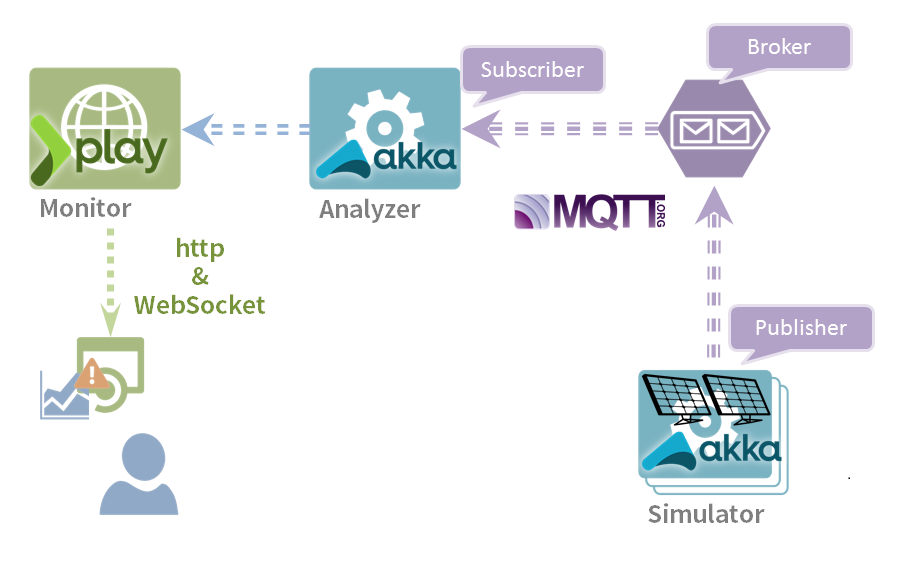
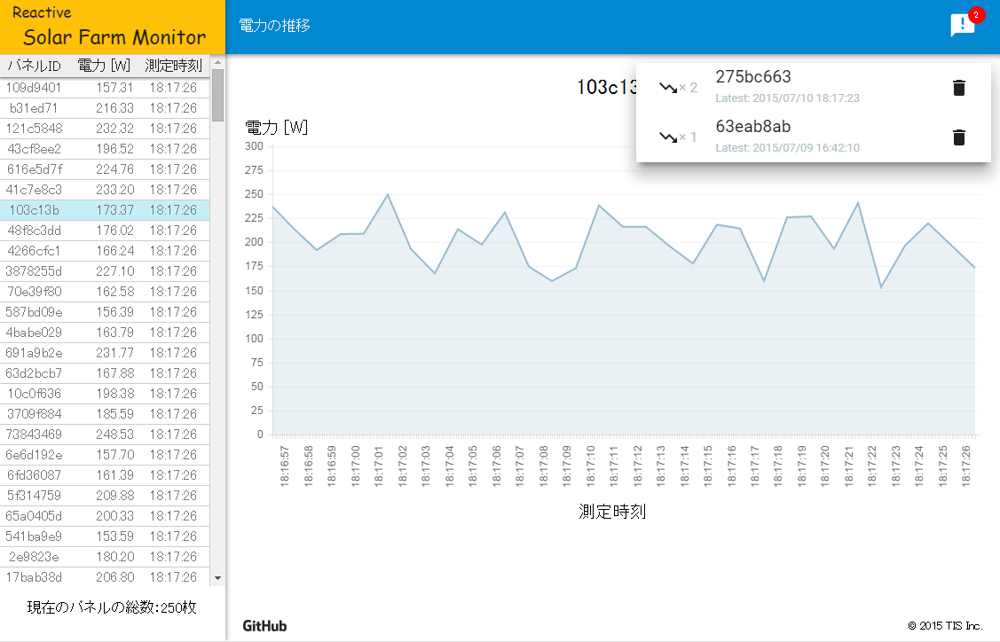

Reactive Solar Farm Monitor
===========================

(English/[Japanese](README.ja.md))

Reactive Solar Farm Monitor is a sample application which is implemented on [Typesafe Reactive Platform](http://www.typesafe.com/products/typesafe-reactive-platform).

What is Reactive Systems?
--------------------------
Reactive Systems satisfy all of the following requirements:
* Keep the system response quick and provide high usability
* Uptime close to 100% as possible
* Scale-out and Scale-in are easy when workload fluctuates

Please refer to [The Reactive Manifesto](http://www.reactivemanifesto.org/) for details.

What is Typesafe Reactive Platform?
---------------------------------

Typesafe Reactive Platform is a Platform for Building Message-Driven, Elastic, Resilient
and Responsive Applications Leveraging the Java Virtual Machine.

To help developers build Reactive applications on the JVM,
Typesafe has brought together the [Play Framework](https://playframework.com/), a runtime
called [Akka](http://akka.io/), and the [Scala](http://www.scala-lang.org/) language under a unified platform.

Please refer to [Typesafe Reactive Platform](http://www.typesafe.com/products/typesafe-reactive-platform) for details.

What is Reactive Solar Farm Monitor?
----
This sample application is a failure detection system of solar panels in the "Solar Farm" (photovoltaic power plant).

It is assumed that Solar farm has tens of thousands of solar panels, and each panel has the measuring device which successively measures and send the amount of power generation. This application calculates the mean value of amounts of power generation of all solar panels, and compares the each amount of power generation with the mean value. If the value has fallen below the mean significantly, the application regards the solar panel as failure.

Also, the system has the following requirements.

* I want to detect failures of solar panels with in 1 second after failure, to improve generation efficiency.
* I want to achieve 100% uptime to no time lag after detect failures.
* I can scale-out the system, if solar panels increase

Architecture
--------------
This sample application uses [Typesafe Reactive Platform](http://www.typesafe.com/products/typesafe-reactive-platform), and adopts Message-driven architecture.

Screenshot
------------------

Get Started
---------

### Use Docker

Execute the following commands on the PC which has already been installed [Docker](https://www.docker.com/).

~~~
docker run -d --name=broker                                    crowbary/apache-apollo
docker run -d --name=solar_farm_simulator --link=broker:broker crowbary/reactive-solar-farm-monitor-solar-farm-simulator
docker run -d --name=monitor -p 9000:9000                      crowbary/reactive-solar-farm-monitor
docker run -d --name=analyzer_seed  --link=broker:broker --link=monitor:primary_seed                                      crowbary/reactive-solar-farm-monitor-analyzer
docker run -d --name=analyzer_node1 --link=broker:broker --link=monitor:primary_seed --link=analyzer_seed:secondary_seed  crowbary/reactive-solar-farm-monitor-analyzer
docker run -d --name=analyzer_node2 --link=broker:broker --link=monitor:primary_seed --link=analyzer_seed:secondary_seed  crowbary/reactive-solar-farm-monitor-analyzer
~~~

Access to http://[DOCKER_HOST]:9000/ from Web browser

* DOCKER_HOST: The IP address of a host on which you executed "docker run" commands.

You can add any number of Analyzer nodes.
Execute the following command to add an Analyzer node.
~~~
docker run -d --link=broker:broker --link=monitor:primary_seed --link=analyzer_seed:secondary_seed  crowbary/reactive-solar-farm-monitor-analyzer
~~~

### Use Typesafe Activator

#### 1. Before running

##### (1) Install Typesafe Activator

* Requirements: JDK6+
* Download the package from [Typesafe Activator's site'](https://www.typesafe.com/get-started)
* Extract the package and add Activator to your PATH

##### (2) Install Apache Apollo

* Download the distribution archive from  [Apache Apollo's site](https://activemq.apache.org/apollo/download.html)
* Extract the distribution archive to ${APOLLO_HOME}
* Create Broker Instance on ${APOLLO_EXEC}
~~~
cd ${APOLLO_EXEC}
${APOLLO_HOME}\bin\apollo create mybroker
~~~
* Refer to [here](http://activemq.apache.org/apollo/versions/1.7.1/website/documentation/getting-started.html)

##### (3) Install Bower

* Install [Node.js](https://nodejs.org/)
* Install [Git](http://git-scm.com/downloads)
    * If you use Windows, you need to available Git commands by checking "Use Git from the Windows Command Prompt" on "Adjusting your PATH environment"
* Install [Bower](http://bower.io/#install-bower)

~~~
npm install -g bower
~~~

#### 2. Create a project and run

##### (1) Create a project

~~~
activator new reactive-solar-farm-monitor reactive-solar-farm-monitor
cd  reactive-solar-farm-monitor
bower install
~~~

##### (2) Run Broker

~~~
${APOLLO_EXEC}\mybroker\bin\apollo-broker run
~~~

##### (3) Run Simulator

~~~
activator solarFarmSimulator/run
~~~

##### (4) Run Analyzer

Requires at least two nodes

~~~
activator analyzer/runNode1
activator analyzer/runNode2
~~~

If you need additional nodes can run to four

~~~
activator analyzer/runNode3
activator analyzer/runNode4
~~~

##### (5) Run Monitor

~~~
activator run
~~~

#### 3. Check the application

Access to [http://localhost:9000/](http://localhost:9000/) from Web browser

# Contact

Please send feedback to us.

[TIS Inc.](http://www.tis.com/)  
System Development Technology R&D Office  
Reactive Systems consulting team  

* <go-reactive@tis.co.jp>.

TIS provides a consulting service about Typesafe Reactive Platform. Please refer to the [our site](http://www.tis.jp/service_solution/goreactive/)(Japanese site) for details.

# License

This application is released under the Apache License version2.0.
The Apache License version2.0 official full text is published at this [link](http://www.apache.org/licenses/LICENSE-2.0.html).

---------

* All company names and product mentioned are trademarks or registered of the respective companies.
* Icon made by [Freepik](http://www.freepik.com) from [www.flaticon.com](http://www.flaticon.com) is licensed under [CC BY 3.0](http://creativecommons.org/licenses/by/3.0/)

Copyright © 2015 TIS Inc.
