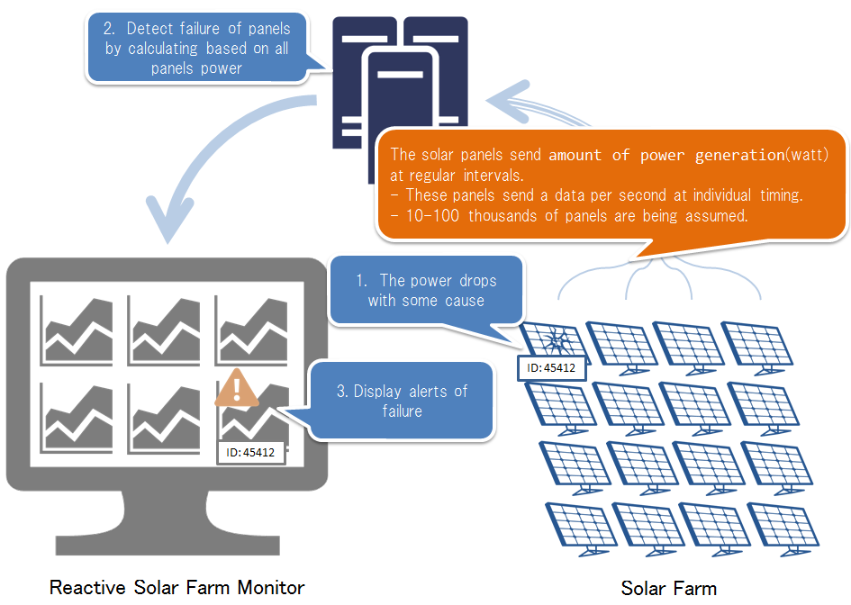

Reactive Solar Farm Monitor
===========================

(English/[日本語](README.ja.md))

Reactive Solar Farm Monitor is a sample application which is implemented by using [Typesafe Reactive Platform](http://www.typesafe.com/products/typesafe-reactive-platform).

What is Reactive Systems?
--------------------------
Reactive Systems satisfy all of the below requirements:
* Keep speedy responses and provide high usability
* Achieve extreamly near 100% uptime
* Scale-out and Scale-in are easy when workload fluctuates

Please refer to [The Reactive Manifesto](http://www.reactivemanifesto.org/) for detail.

What is Typesafe Reactive Platform?
---------------------------------

Typesafe Reactive Platform is an integrated platform which has [Play Framework](https://playframework.com/), [Akka](http://akka.io/), and [Scala](http://www.scala-lang.org/)(or [Java](https://www.java.com/) ) for creating Reactive Systems. Reactive Systems created by this platform on JVM.

Please refer to [Typesafe Reactive Platform](http://www.typesafe.com/products/typesafe-reactive-platform) for detail.

What is Reactive Solar Farm Monitor?
----
This sample application is assumed a failure detection system of many solar panels which huge Solar Farm has.

Solar farm has several ten thousand panels, and each panel has a power generation measure device. How do you detect failures of the solar panels? If the power generation of the panels is reduced, do you regard the panels as failure? In this case, when it is also bad weather, you regard the panels as failure.
And so, this application is compare mean of the power generation of all panels and the power generation of each panel. Then, the application regard the panels whose power generation are reduced by a remarkable amount is failure.

Also, the system has the following requirements.

* I want to detect failures of solar panels with in 1 second after failure, to improve generation efficiency.
* I want to achieve 100% uptime to no time lag after detect failures.
* I can scale-out the system, if solar panels increase

Architecture
--------------
This sample application use [Typesafe Reactive Platform](http://www.typesafe.com/products/typesafe-reactive-platform), and created by Message-Driven.

Screenshot
------------------

Get Started.
---------

### Use Docker

Execute the following commands. The requirement of a hosts is only [Docker](https://www.docker.com/).

~~~
docker run -d --name=broker   -p 61613:61613                        crowbary/apache-apollo
docker run -d --name=solar_farm_simulator  --link=broker:broker     crowbary/reactive-solar-farm-monitor-solar-farm-simulator
docker run -d --name=analyzer -p 2551:2551 --link=broker:broker     crowbary/reactive-solar-farm-monitor-analyzer
docker run -d --name=monitor  -p 9000:9000 --link=analyzer:analyzer crowbary/reactive-solar-farm-monitor
~~~

Access to http://[DOCKER_HOST]:9000/

* DOCKER_HOST: The IP address of a host on which you executed "docker run" commands.

### Use Typesafe Activator

How to install via [Typesafe Activator](https://www.typesafe.com/get-started) is currently being prepared.

# Contact

Please send feedback to us.

[TIS Inc.](http://www.tis.com/)
System Development Technology R&D Office
Reactive Systems consulting team
<go-reactive@tis.co.jp>.

TIS provides a consulting service about Typesafe Reactive Platform. Please refer to the [our site](http://www.tis.jp/service_solution/goreactive/) for detail.

# License

Skalholt is released under the Apache License version2.0.
The Apache License version2.0 official full text is published at this [link](http://www.apache.org/licenses/LICENSE-2.0.html).

---------

* All company names and product mentioned are trademarks or registered of the respective companies.
※ Icon made by [Freepik](http://www.freepik.com) from [www.flaticon.com](http://www.flaticon.com) is licensed under [CC BY 3.0](http://creativecommons.org/licenses/by/3.0/)

Copyright © 2015 TIS Inc.
